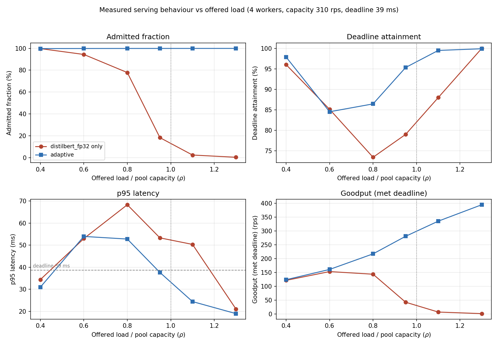

# Anytime Inference Planner

Latency-bounded ML serving. A Python control plane watches queue depth and CPU
load, then routes each request to one of several profiled model variants so that
as much traffic as possible completes inside a deadline. Inference runs in a C++
ONNX Runtime engine loaded into the process as an extension module.

Variant selection is a constrained optimisation: maximise expected accuracy
subject to an M/M/c sojourn-time bound and the measured backlog.



## Results

DistilBERT-SST-2 and MiniLM-L6 served from a 4-worker pool on an Apple M4 Pro,
real SST-2 validation traffic, 39 ms deadline. Offered load is a fraction of the
measured pool capacity of 310 rps. Goodput counts only requests that completed
within the deadline; p95 is the adaptive policy's.

| Offered load | Goodput, accurate-only | Goodput, adaptive | Compute cost | p95 |
| --- | --- | --- | --- | --- |
| ρ = 0.40 | 122 rps | 124 rps | 1.00 | 31 ms |
| ρ = 0.80 | 144 rps | 217 rps | 0.79 | 53 ms |
| ρ = 0.95 | 43 rps | 281 rps | 0.49 | 38 ms |
| ρ = 1.30 | 2 rps | 394 rps | 0.41 | 19 ms |

Below ρ ≈ 0.5 the planner keeps every request on the most accurate variant and
matches the baseline exactly. As the queue builds it shifts traffic to the cheaper
variant: at ρ = 0.95 that is **6.5x the goodput at 49% of the compute cost**, for
at most 0.92 accuracy points (91.06% to 90.14% on SST-2 validation).

Measured through the serving path itself, with every variant cross-checked against
a separate ONNX Runtime session. Repeating the sweep moved goodput by at most 6%,
and service times carry a 1-4% run-to-run spread, so treat the third digit as
noise.

Full tables, methodology, and host details: [`docs/benchmarks.md`](docs/benchmarks.md).

## Install

```bash
python3 -m venv venv && source venv/bin/activate
pip install -e ".[dev]"
```

Extras: `bench` for benchmark drivers and figures, `research` for model export and
offline profiling, `dev` for everything plus lint, types, and tests.

## Quick start

```bash
python scripts/demo_serving.py
```

Self-contained: builds a small synthetic ONNX model, drives Poisson traffic
through both policies, and prints a JSON summary. Needs no model download.

Reproduce the measured results end to end:

```bash
python scripts/export_onnx.py --task text     # export FP32 and INT8 variants
python scripts/profile_variants.py            # measure the Pareto frontier
python scripts/run_load_sweep.py              # sweep load, write the figure
```

## Tests

```bash
pytest -q
```

The serving tests build a tiny ONNX graph on the fly, so they run without torch.
Tests needing the compiled extension are marked and skip when it is absent.

## Documentation

| | |
| --- | --- |
| [Architecture](docs/architecture.md) | control plane and worker split, request lifecycle |
| [Planner](docs/planner.md) | admission control, Erlang-C, variant selection |
| [Runtime](docs/runtime.md) | C++ engine, build, version matching |
| [Quantisation](docs/quantization.md) | why the variant frontier is measured, not assumed |
| [Benchmarks](docs/benchmarks.md) | methodology, full results, reproduction |
| [Development](docs/development.md) | dependency groups, tests, CI, layout |

## Notes

Three findings shaped the current design and are worth knowing before extending it:

- **Worker count belongs in the queueing model.** Modelling a c-worker pool as a
  single server understates capacity by a factor of c. `AdaptiveServer` now
  refuses a selector that models a different pool size.
- **Match the C++ ONNX Runtime version to the Python wheel.** A mismatch measured
  DistilBERT at 98.9 ms in the worker against 13.0 ms in the profiler, which
  silently invalidated every admission decision. The version is now derived from
  the installed wheel at build time and checked again at import, so it cannot
  drift.
- **Measure through the serving path, not beside it.** That mismatch survived
  because profiling used a separate process. Profiling now runs through the same
  client the server dispatches to, and fails if a cross-check disagrees.

## License

MIT. See [LICENSE](LICENSE).
