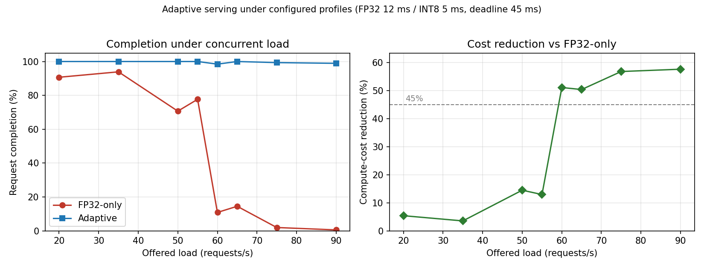

# Anytime Inference Planner

Latency-bounded ML serving with adaptive precision selection. A Python control
plane monitors CPU load in real time and routes each request to either a
full-precision (FP32) or quantised (INT8) ONNX model served by a C++ runtime.
Variant selection is framed as a constrained optimisation: maximise expected
accuracy subject to a deadline, with the deadline budget enforced by an
M/M/1-based admission controller.

## Architecture

```text
                +-----------------------------+
  requests ---> | AdaptiveServer (Python)     |
                |   - LoadMonitor (psutil)    |
                |   - MM1AdmissionController  |
                |   - AdaptiveSelector        |
                +--------------+--------------+
                               |  ThreadPool
                               v
                +-----------------------------+
                | RuntimePool (Python client) |
                +--------------+--------------+
                               |  line-delimited JSON
                               v
                +-----------------------------+
                | anytime_runtime (C++)       |
                |   ONNX Runtime sessions     |
                |   FP32 + INT8 variants      |
                +-----------------------------+
```

- **Load monitor.** Background thread sampling `psutil.cpu_percent` with an
  exponential moving average. Smoothed load is the planner's feedback signal.
- **Selector.** Picks the highest-accuracy variant whose expected service time,
  inflated by current CPU pressure, still admits under the M/M/1 sojourn bound.
- **Admission controller.** Computes `E[W_q] + 1/mu` from the observed arrival
  rate and the candidate variant's service rate; rejects the request when this
  would exceed the deadline budget. Derived directly from the M/M/1 stationary
  result.
- **Runtime client.** Spawns the C++ binary as a subprocess and exchanges
  base64-framed JSON over stdin/stdout. A pure-Python ONNX Runtime backend is
  used automatically if the binary is not present.

## Results

Sweeping offered load against a fixed 45 ms deadline (FP32 12 ms / INT8 5 ms
service profiles, 4 workers) compares the adaptive policy with an FP32-only
baseline under the same Poisson arrival stream:



| Offered load (rps) | FP32-only completion | Adaptive completion | Cost reduction |
| --- | --- | --- | --- |
| 35 | 94% | 100% | 4% |
| 50 | 71% | 100% | 14% |
| 60 | 12% | 98% | 51% |
| 75 | 3% | 99% | 57% |
| 90 | 1% | 99% | 58% |

Once offered load approaches the FP32 service limit, the baseline sheds the
majority of requests while the adaptive policy keeps completion at ~99% by
routing to INT8. Mean compute cost per served request falls by **~45–57% under
heavy load** (the dashed line in the figure marks the 45% reference), with no
loss in deadline hit rate. Reproduce with `python scripts/plot_benchmark.py`.

These figures come from the serving harness running the configured variant
profiles; the routing and admission decisions are driven by live CPU load, so
exact numbers vary run to run.

## Repository layout

```text
src/
  serving/        load monitor, admission control, runtime client, server
  planner/        offline deadline-aware planner and baselines
  models/         model zoo, cascade evaluator, quantisation helpers
  evaluation/     statistical analysis (CIs, paired tests, effect sizes)
  profiler/       offline latency and accuracy profilers
  theory/         Pareto utilities, deadline-scheduling helpers, MDP framing
  utils/          io, logging, metrics, visualisation
  workloads/      synthetic Poisson / bursty trace generators
runtime_cpp/      C++ ONNX Runtime worker (CMake project)
scripts/          ONNX export and concurrent benchmark driver
experiments/      offline profiling and statistical evaluation pipeline
training/         optional fine-tuning entry points
configs/          deadlines, model zoo, serving SLO config
tests/            pytest unit + integration tests
```

## Quick start

```bash
python3 -m venv venv && source venv/bin/activate
pip install -r requirements.txt
```

### Offline profiling and evaluation

```bash
python data/download_datasets.py
python run_all.py                # full pipeline
python run_all.py --quick-test   # smaller sample sizes for development
```

Outputs land under `results/` (per-configuration CSVs and figures).

### Self-contained demo

Quickest way to verify the serving stack — builds a tiny synthetic ONNX model
on the fly so no torch export or C++ build is needed:

```bash
python scripts/demo_serving.py --duration 3 --arrival-rate 75 --deadline-ms 45
```

Prints a JSON summary comparing the FP32-only baseline against the adaptive
policy under an identical Poisson arrival stream.

### Online serving benchmark (real models)

1. Export the FP32 and INT8 ONNX models:

   ```bash
   python scripts/export_onnx.py --task vision --output-dir models/onnx
   ```

2. Build the C++ runtime (optional — a pure-Python fallback is used otherwise):

   ```bash
   export ONNXRUNTIME_ROOT_PATH=/path/to/onnxruntime
   cmake -S runtime_cpp -B runtime_cpp/build -DCMAKE_BUILD_TYPE=Release
   cmake --build runtime_cpp/build -j
   ```

3. Run the concurrent benchmark:

   ```bash
   python scripts/run_benchmark.py \
       --fp32-model models/onnx/vision_fp32.onnx \
       --int8-model models/onnx/vision_int8.onnx \
       --input-name input --input-shape 1 3 224 224 \
       --duration 20 --arrival-rate 80 --deadline-ms 60
   ```

The benchmark emits a JSON summary with completion rate, deadline hit rate,
and cost reduction versus the FP32-only baseline, plus a per-request CSV at
`results/serving_benchmark.csv`.

## Tests

```bash
pytest -q
```

The serving stack tests construct a tiny ONNX identity model on the fly, so
they run without requiring the C++ binary or torch.

## Configuration

`configs/serving.yaml` collects the SLO, pool size, arrival rate, and
per-variant profile defaults used by the benchmark driver. Profile values
should be sourced from the offline latency profiles produced by
`experiments/01_profile_latency.py`.
