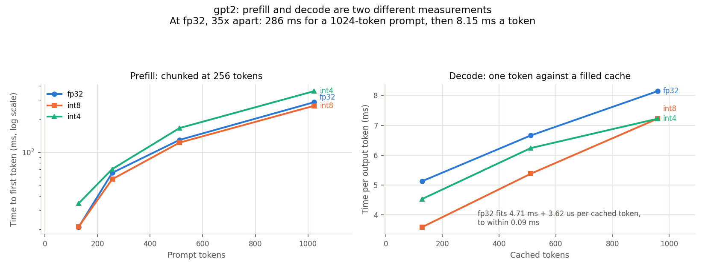
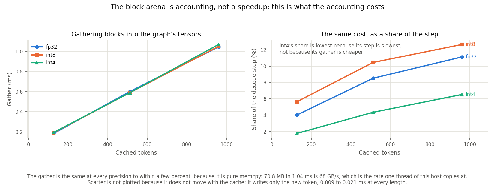
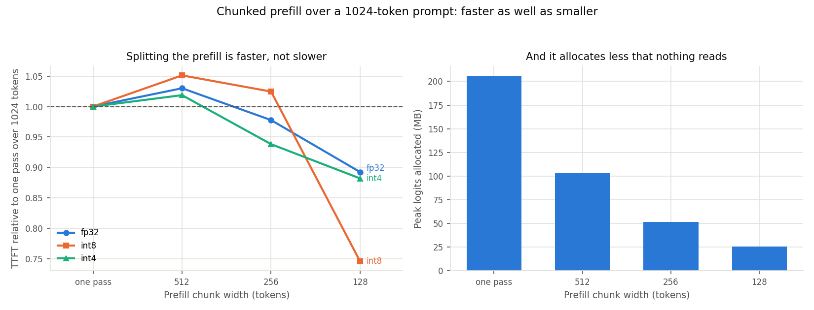
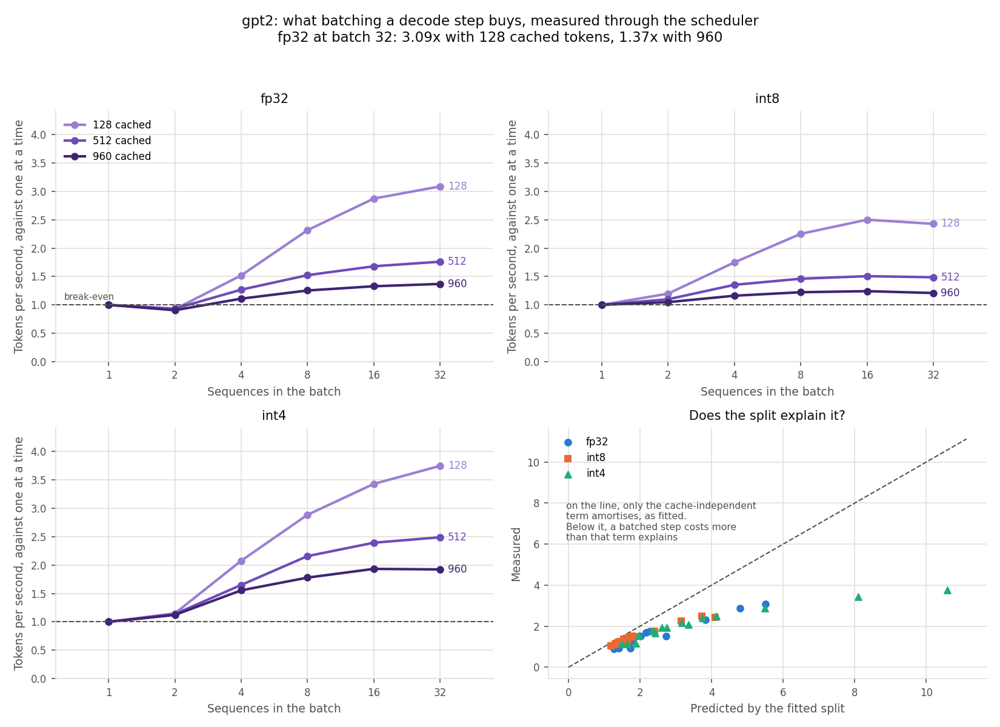
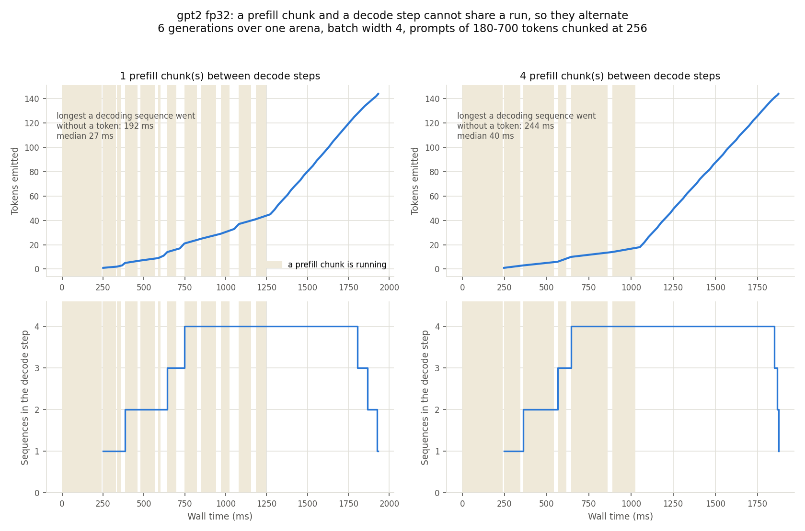
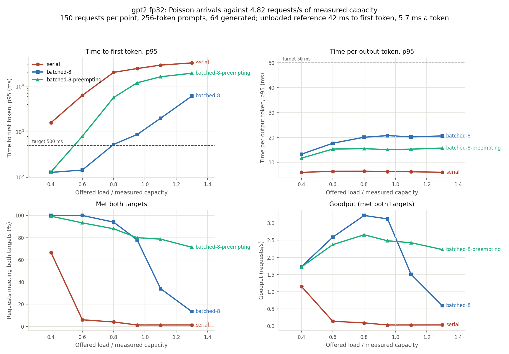

# Benchmarks

Every number here is measured on the host recorded below. None is modelled,
assumed, or carried over from another machine.

## Host and configuration

| | |
| --- | --- |
| Platform | macOS 26.5.2, arm64 (Apple M4 Pro, 14 cores, 24 GB) |
| ONNX Runtime | 1.26.0, CPU execution provider |
| Python | 3.14.0 |
| Workers | 4, one intra-op thread each (encoder); decoder session runs 8, see below |
| Batch size | 1 |
| Sequence length | 128 tokens |
| Task | [SST-2](https://huggingface.co/datasets/stanfordnlp/sst2) binary sentiment |
| Accuracy split | [GLUE](https://gluebenchmark.com/) SST-2 validation, all 872 examples |
| Latency samples | 200 per pass, 3 independent passes per variant, 20 warmup iterations each |
| Deadline | 38.7 ms (3x the slowest frontier variant) |
| Measured through | the `anytime_runtime` extension, the same path the server uses |

Recorded in full in `results/variant_profiles.json`.

## Variant frontier

Service time is wall time per request through `RuntimeClient`, which is what the
pool actually spends. It is reported as the median of three independent
measurement passes; the spread column is the range across those passes.

| Variant | p50 | Spread | p95 | p99 | stdev | Accuracy | Size | Relative cost | Verdict |
| --- | --- | --- | --- | --- | --- | --- | --- | --- | --- |
| `distilbert_fp32` | 12.89 ms | 4.0% | 14.24 ms | 15.41 ms | 1.02 ms | 91.06% | 268 MB | 1.000 | frontier |
| `minilm_fp32` | 5.19 ms | 2.0% | 5.46 ms | 5.62 ms | 0.13 ms | 90.14% | 91 MB | 0.403 | frontier |
| `distilbert_int8` | 17.17 ms | 1.4% | 18.38 ms | 19.51 ms | 0.85 ms | 90.60% | 67 MB | 1.332 | dominated |
| `minilm_int8` | 7.16 ms | 0.9% | 7.45 ms | 7.75 ms | 0.22 ms | 90.14% | 23 MB | 0.556 | dominated |

The measured 91.06% for
[DistilBERT-SST-2](https://huggingface.co/distilbert/distilbert-base-uncased-finetuned-sst-2-english)
matches the roughly 91.3% its model card reports on SST-2 dev, which is the main
sanity check on the measurement path. All four accuracies reproduce Stage 1 exactly,
which is the check that the engine's logits are the same logits.

Both INT8 variants are strictly dominated: slower with no accuracy gain. See
[`quantization.md`](quantization.md).

### Why three passes

One pass is not enough on this host. Measuring the same 200-request p50 eight
times gave 13.84 to 14.73 ms for DistilBERT and 5.62 to 5.83 ms for MiniLM, a
range of 6.5% and 3.6%, driven by thermal state and scheduler placement rather
than by anything in the code. The within-pass standard deviation is around 0.45 ms
and says nothing about that, so a single p50 quoted with a within-pass spread
overstates its own precision. Reporting the median of three passes, with the range
across them, is why the spread column exists.

This also sets the cross-check tolerance. Engine and separate session agreed to
within 2% here (0.980x to 1.007x), and the 15% bound is loose enough not to fire
on that drift while still catching anything structural.

## Load sweep

Offered load is expressed as a fraction of measured pool capacity
(4 workers / 12.89 ms = 310 rps) rather than as a bare request rate. Both
policies see the same Poisson arrival stream of real SST-2 sentences, tokenised
before the run so the measurement is inference rather than preprocessing. Three
seconds of arrivals per point, which is the script's default.

Goodput counts only requests that completed within the deadline; it is the metric
that matters, because admitted-and-late is worth nothing to a caller.

| ρ | Rate | Policy | Admitted | Attainment | p50 | p95 | Goodput | Cost |
| --- | --- | --- | --- | --- | --- | --- | --- | --- |
| 0.40 | 124 rps | accurate-only | 99.7% | 96.0% | 16.3 ms | 34.4 ms | 122 rps | 1.000 |
| 0.40 | 124 rps | adaptive | 99.7% | 97.9% | 15.6 ms | 31.0 ms | 124 rps | 1.000 |
| 0.60 | 186 rps | accurate-only | 94.4% | 85.1% | 24.1 ms | 53.0 ms | 153 rps | 1.000 |
| 0.60 | 186 rps | adaptive | 99.8% | 84.5% | 25.1 ms | 53.9 ms | 161 rps | 0.942 |
| 0.80 | 248 rps | accurate-only | 77.9% | 73.4% | 34.3 ms | 68.3 ms | 144 rps | 1.000 |
| 0.80 | 248 rps | adaptive | 99.9% | 86.5% | 29.1 ms | 52.8 ms | 217 rps | 0.790 |
| 0.95 | 295 rps | accurate-only | 18.4% | 79.0% | 30.9 ms | 53.3 ms | 43 rps | 1.000 |
| 0.95 | 295 rps | adaptive | 99.9% | 95.3% | 7.3 ms | 37.6 ms | 281 rps | 0.489 |
| 1.10 | 341 rps | accurate-only | 2.5% | 88.0% | 28.8 ms | 50.3 ms | 7 rps | 1.000 |
| 1.10 | 341 rps | adaptive | 99.9% | 99.5% | 6.3 ms | 24.5 ms | 335 rps | 0.415 |
| 1.30 | 403 rps | accurate-only | 0.4% | 100.0% | 17.0 ms | 21.1 ms | 2 rps | 1.000 |
| 1.30 | 403 rps | adaptive | 99.9% | 99.9% | 7.4 ms | 19.0 ms | 394 rps | 0.405 |

Repeating the whole sweep twice more with the same seed moved goodput by at most
6%, and the ρ = 0.95 adaptive figure by 2% (281, 286, 285 rps). The accurate-only
column is the noisier one, because it is computed from however few requests
admission happens to let through.


### Reading the results

- **Below ρ ≈ 0.5 the policies are identical.** The adaptive planner routes 378
  of 378 requests to DistilBERT and matches the baseline. It does not degrade
  quality it does not need to.
- **The gap opens as the queue builds.** At ρ = 0.95 adaptive delivers 281 rps of
  goodput against 43 rps, at 49% of the compute cost, having moved 753 of 881
  requests to MiniLM.
- **The accuracy cost is bounded and small.** MiniLM measures 90.14% against
  DistilBERT's 91.06%, so the worst case is 0.92 accuracy points, and only for
  the shifted fraction.
- **At ρ = 0.60 the attainment curves cross.** Adaptive attains 84.5% against
  85.1%, marginally worse, while admitting 99.8% against 94.4%. Admitting nearly
  everything puts more work in the queue, so attainment among admitted requests
  does not improve; goodput still does, 161 rps against 153. This is worth stating
  because it is the one point where the adaptive policy is not uniformly better on
  every axis.
- **Attainment for `accurate-only` is noisy above ρ = 0.9** because it is
  conditioned on admitted requests, and very few are admitted there. At ρ = 1.30
  it admits 5 requests and all 5 hit, giving 100% attainment and 2 rps of
  goodput. This is why goodput, not attainment, is the headline.

## Decoder: prefill and decode are two different measurements

GPT-2 124M through the block-allocated KV cache, measured by
`scripts/profile_decode.py` through the same `DecoderClient` that serves decoding.
Recorded in full in `results/decode_profiles.json`.

The headline is the gap. Time to first token and time per output token differ by a
factor of 35 at FP32 and 50 at INT4, so a single latency figure would describe
neither phase.

| Precision | TTFT, 1024-token prompt | TPOT, 960 cached | TTFT / TPOT | Arena cost |
| --- | --- | --- | --- | --- |
| `fp32` | 285.5 ms (8.8%) | 8.15 ms (3.2%) | 35.1x | 14.2% |
| `int8` | 264.8 ms (12.4%) | 7.22 ms (17.4%) | 36.7x | 16.3% |
| `int4` | 359.7 ms (31.1%) | 7.22 ms (18.2%) | 49.8x | 16.6% |

TTFT is a chunked prefill at the 256-token default; the percentage is the range across
seven passes. "Arena cost" is the gather plus scatter as a share of the decode step --
what block accounting costs, and it rose from 11-13% because threading shrank the step
around a gather that is this process's own serial memcpy and did not move.

**Read the spread column carefully, and do not compare it with an earlier run's.** It is
a min-max range, so it widens with the number of passes by construction; this run took
seven where the previous took three. The medians are the stable part and agree with a
three-pass run to within 3%. The ranges are genuinely wider at eight threads than at
one, though: a prefill divided across a thread pool varies more than one that is not.



### TPOT grows with the cache, so one figure is not enough

A decode step re-reads the whole cache before it runs, so its cost is a line in the
number of cached tokens rather than a constant:

| Cached tokens | Cache size | `fp32` TPOT | Gather | Scatter | Arena cost |
| --- | --- | --- | --- | --- | --- |
| 128 | 9 MB | 5.12 ms | 0.185 ms | 0.010 ms | 3.8% |
| 512 | 38 MB | 6.66 ms | 0.639 ms | 0.013 ms | 9.8% |
| 960 | 71 MB | 8.15 ms | 1.139 ms | 0.016 ms | 14.2% |

The gather is pure `memcpy`, so it comes out the same at every precision to within a
few percent -- 0.19, 0.64 and 1.14 ms at the three lengths, spreading 5% across
precisions at 128 tokens and 2% at 960 -- because it moves the same bytes whatever the
weights are.

70.8 MB in 1.139 ms is 62 GB/s. That is **not** near this host's peak memory
bandwidth, and the comparison that matters is not the peak but what one thread can do:
a plain 70.8 MB `np.copyto` on the same host measures 1.049 ms as the median of three
passes, against the gather's 1.139. The gather is therefore already running at about
the rate one thread copies at, and the only ways to make it cheaper are to move fewer
bytes or to use more than one thread. It is now the largest single item in a decode
step that this repository owns rather than delegates to ONNX Runtime, which is what
makes both of those worth doing rather than noting.

The scatter stays near zero because it writes only the new token rather than the
whole `present` tensor, which is worth about 1 ms a step at full context.



So the price of block accounting is about 4% of a decode step at short context and
14-17% at long, having risen from 11-13% because threading shrank the step around it.
`scripts/profile_decode.py` also runs the same generation over contiguous KV and fails
rather than reporting anything if the two disagree on the tokens they emit, or if the
arena takes more than 15% longer inside `Session::Run`. Measured, the two agree on
tokens exactly.

That timing check is one-sided, and the reason is a measurement rather than a
convenience. At INT4 with a full cache the arena comes out **faster** than contiguous
KV inside `Run` -- 0.83x to 0.88x over three runs, with the arena's own time stable to
2% and the contiguous side the one that moves. The gather leaves the staging buffer hot
in cache; the contiguous path feeds freshly allocated arrays that are cold, and INT4
shows it because its weights are compressed, so cache traffic is a larger share of what
the step reads. Identical shapes cannot make the graph do *more* work, so the arena
being slower would still mean a fault; being faster has an explanation. None of this
makes the arena a speedup -- the arena cost above is positive and is the honest
number.

`kv_admission.CacheCost` is fitted to these points rather than written down: FP32
comes out at 4.71 ms plus 0.00362 ms per cached token, which reproduces all three
measurements to within 0.09 ms. Recompute is 0.27 ms per token, fitted from the chunked
prefill because that is the width a resume actually runs at. Drawing it from
the single-pass sweep beside it instead would overstate every recompute by 13% and
leave the eviction policy needlessly unwilling to act.

The whole run was repeated to check it. Medians reproduced within 3% between a
three-pass and a seven-pass run -- FP32 TPOT at 960 cached read 8.02 then 8.15 ms, INT8
7.03 then 7.22. Started back to back with no pause it drifts further, which is worth
knowing before comparing two runs.

### Chunked prefill is faster and smaller

Splitting a prefill into chunks re-reads the growing cache, so it ought to cost more.
It does not, because a single pass over 1024 tokens also allocates logits for every
position -- 206 MB -- when sampling reads one row of them. Chunking a prefill is the
first half of [SARATHI](https://arxiv.org/abs/2308.16369); the second half, sharing
a run with decode steps, is not reachable over this graph, for the reason in
[`architecture.md`](architecture.md).

| Prefill width | `fp32` TTFT | vs one pass | Peak logits |
| --- | --- | --- | --- |
| 512 | 300.8 ms | 1.030x | 103 MB |
| 256 | 285.5 ms | 0.978x | 52 MB |
| 128 | 260.6 ms | 0.893x | 26 MB |
| one pass | 292.0 ms | 1.000x | 206 MB |

**Chunking still wins, and the widths can no longer be ranked against each other.** At
128 tokens all three precisions beat a single pass — 0.89x at FP32, 0.75x at INT8,
0.88x at INT4 — so the memory argument holds. But the run-to-run ranges at eight threads
are 3% to 41%, far wider than the gaps between adjacent widths, so any claim that one
width beats its neighbour is not supported by this measurement. The earlier one-thread
run could rank them (256 clearly fastest at 0.858x); this one cannot, and saying which
is fastest would be reading noise.

256 tokens remains the default, now on the two grounds that are not about speed: at four
blocks of 64 it aligns with the allocator, and it gives the scheduler a preemption point
inside a long prefill.

This was checked with the chunk widths interleaved, because measuring them in sequence
would record thermal drift instead.



### INT8 is not dominated on the decoder

Stage 1 found INT8 strictly dominated on this host, and
[`quantization.md`](quantization.md) records it. That was an encoder at sequence length
128, and on the decoder the ordering reverses:

| Precision | TPOT at 128 cached | at 512 | at 960 | vs FP32 |
| --- | --- | --- | --- | --- |
| `fp32` | 5.12 ms | 6.66 ms | 8.15 ms | 1.000x |
| `int8` | 3.58 ms | 5.38 ms | 7.22 ms | 0.70x to 0.89x |
| `int4` | 4.53 ms | 6.24 ms | 7.22 ms | 0.88x to 0.94x |

INT8 leads by 28% at 128 cached tokens and 11% at 960. At +0.063 perplexity for 0.61x
the graph size it is the decode variant to serve here — but it does not dominate, and
the difference matters when reading the frontier. INT4 is smaller (367 MB against 398)
and FP32 is more accurate (31.307 against 31.371), so all three sit on the frontier and
what INT8 wins is speed. "Not dominated" is the claim; "wins on every axis" would not
be true of any of them.

**INT4 stopped being the slow one, and that is a threading result rather than a
quantisation one.** On a single thread its decode step was 1.74x to 2.39x FP32's and
its 1024-token prefill was 1772 ms. On eight it decodes *faster* than FP32 at every
occupancy and prefills in 360 ms. Unpacking 4-bit weights to float per matrix multiply
is serial arithmetic, and it is exactly the kind of work a thread pool divides well, so
the penalty that looked like a property of the format was substantially a property of
running it on one core. `quantization.md` carries the same correction.

### What the reversal does and does not establish

Three things differ between the encoder measurement and this one, not one:

- **Model.** DistilBERT and MiniLM against GPT-2.
- **Shape.** Sequence length 128 in one pass, against a 256-token prefill chunk and
  then single-token decode steps.
- **The quantisation recipe itself.** `export_onnx.py` asks optimum for
  `AutoQuantizationConfig.arm64(is_static=False, per_channel=False)`, which is
  per-tensor across the graph. `export_decoder.py` runs `quantize_dynamic` with
  `per_channel=True` over `MatMul` and `Gemm` only, with the output projection
  excluded, because including it measured 44.4 perplexity against 26.8 for the
  unquantised graph in that same early run — a smaller scoring configuration than the
  32 windows above, so those two numbers compare with each other and not with this
  page's table.

So the honest conclusion is that the encoder result does not generalise to the
decoder. It is not evidence that decode shape alone is responsible, and the usual
explanation — that decode at length 1 is a matrix-vector product bound by the
bandwidth to read weights — does not even cover the whole result, because INT8 also
wins the 256-token chunked prefill, which is not a matrix-vector product.

What the fitted cost model does isolate is the part of the step precision acts on:

| Precision | Cache-independent term | Per cached token | Cache-independent share at 960 |
| --- | --- | --- | --- |
| `fp32` | 4.71 ms | 3.62 µs | 58% |
| `int8` | 3.06 ms | 4.37 µs | 42% |
| `int4` | 4.28 ms | 3.21 µs | 59% |

The per-token coefficients agree within 36% across precisions while the constant terms
span 1.5x. Reading the cache is precision-invariant, as it must be — the arena is
float32 whatever the weights are — and quantisation acts on the constant part. That is
enough to explain the narrowing lead without claiming to have identified the
bottleneck: by the same fit, the term INT8 shrinks is 85% of an FP32 step at 128 cached
tokens and 44% at 960.

INT4 is no longer dominated on speed, and that is the largest thing threading changed
here. On one thread its constant term carried the per-run cost of unpacking 4-bit
weights and it was 1.7x to 2.4x FP32 on decode; on eight that unpacking is divided
across the pool, its fitted constant falls from 10.76 ms to 4.28 ms, and it decodes
faster than FP32 at every occupancy. It still loses on prefill and still costs 1.559
perplexity, so it is not the variant to serve — but "it buys memory and nothing else"
was a statement about one core, not about the format.

## Batching a decode step: a throughput win that decays with the cache

`scripts/profile_batching.py` measures this through `ContinuousBatchScheduler`, which
is the thing that would do it in service. An earlier round of these numbers was taken
by calling `Engine.run` with hand-assembled batch tensors, and it overstated the result
by about 20% at short context because it left out the gather, the padding, the scatter
and the scheduler. Those numbers are gone; these replace them.

Speedup is against the same sequences stepped **one at a time at the same cached
length**, through the same scheduler — not against nothing, and not against a batch
divided by its width. A batched step's duration is what every sequence in it waited.

| Batch | `fp32` 128 | 512 | 960 | `int8` 128 | 512 | 960 | `int4` 128 | 512 | 960 |
| --- | --- | --- | --- | --- | --- | --- | --- | --- | --- |
| 2 | 1.53x | 1.40x | 1.28x | 1.49x | 1.23x | 1.21x | 1.40x | 1.33x | 1.20x |
| 4 | 2.25x | 1.87x | 1.55x | 2.00x | 1.69x | 1.32x | 2.00x | 1.66x | 1.35x |
| 8 | 3.00x | 2.15x | 1.67x | 2.34x | 1.84x | 1.41x | 2.32x | 1.83x | 1.44x |
| 16 | 3.42x | 2.25x | 1.71x | **2.58x** | 1.86x | **1.44x** | 2.43x | **1.87x** | 1.50x |
| 32 | **3.47x** | **2.26x** | **1.71x** | 2.44x | **1.86x** | 1.42x | **2.66x** | 1.87x | **1.51x** |

In tokens per second, `fp32` runs 193 at batch 1 and 668 at batch 32 with 128 cached
tokens; at 960 cached it runs 123 and 210.

**These are measured with the decoder session on eight threads**, which is what
`serving/decoder.py` now defaults to and therefore what would serve. An earlier round
of this table was taken with the session pinned to one thread, inherited from the
encoder without being revisited, and it understated batching at every point — most at
full context, where batch 32 read 1.37x against the 1.71x here. Why the two compound is
in [Threading the decoder session](#threading-the-decoder-session) below.

**The gain decays with cache occupancy, which is what the fitted split predicts.** Only
the cache-independent term of a decode step can be shared across a batch; the
per-cached-token term is per sequence, because each sequence reads its own cache. So the
more cache there is, the less of a step is amortisable. INT4 gains most at full context
— 1.9x against FP32's 1.4x — because its cache-independent term is the largest share of
its step, which is the same fitted split that explains its prefill penalty.

**Three things the curve says that the prediction did not.**

- **Returns stop by batch 16 for FP32 and INT8.** INT8 is marginally *slower* at 32 than
  at 16 at 128 and 960 cached. Only INT4, whose step is dominated by the shared term, is
  still gaining at 32, and only at short context.
- **Measured always falls short of predicted**, by 17-65% at short context and 9-28% at
  long. The shortfall is inside `Session::Run` rather than in the gather, the padding or
  the scheduler, all three of which are timed separately and add up to a small fraction
  of it.
- **A per-row constant does not explain the shortfall either.** Fitting
  `shared + per_row × B + per_token × B × L` over every point leaves worst-case errors
  of 21-29%, and fitting it on batches of 4 and above and extrapolating down puts batch
  1 off the line in *opposite directions* for FP32 and INT8. So the honest statement is
  that the split predicts the shape — the decay with occupancy, and INT4 gaining most —
  and does not predict the level.

**The batch-2 loss was a threading artefact, and saying so retires a hypothesis.** With
the session on one thread, FP32 at batch 2 was a genuine loss at every occupancy —
0.92x, 0.93x, 0.91x, reproduced in two runs at sub-1% spreads. On eight threads it is a
1.53x / 1.40x / 1.28x gain. Earlier versions of this page offered "a batch-1 decode step
takes a different kernel from a batched one" as an unmeasured hypothesis for the
shortfall above, and cited the batch-2 loss as consistent with it. That evidence is
gone: a batch of two on one core doubles the work with no extra parallelism to exploit
while still paying the gather and the padding, which is a sufficient explanation and
does not need a kernel switch. The shortfall against the fitted split remains
unexplained, and now has no supporting evidence for that particular mechanism, so the
hypothesis is withdrawn rather than restated.



### Threading the decoder session

The encoder pins ONNX Runtime to one intra-op thread per worker, and there it is
load-bearing: N single-threaded workers are N independent servers, which is what makes
the M/M/c model in [`planner.md`](planner.md) valid. The decoder lane inherited that pin
and it should not have. There is no worker pool here — one scheduler over one arena — so
there is no per-worker budget to protect.

`fp32`, 960 cached tokens, median of three passes, confirmed by a second run:

| Threads | Step, batch 32 | Step, batch 8 | Batching payoff at batch 32 |
| --- | --- | --- | --- |
| 1 | 222.2 ms | 59.4 ms | 1.35x |
| 8 | **148.3 ms** | **38.6 ms** | **1.79x** |
| 10 | 215.1 ms | 49.6 ms | 1.23x |
| 14 | erratic | erratic | 0.63x at 128 cached |

**Threading and batching compound.** Eight threads is 1.50x on the step, and it also
makes batching itself pay more — 1.35x to 1.79x over stepping one at a time. A batch-1
decode is a skinny GEMV with little for a thread pool to divide; a wide batch is a real
GEMM. Batching supplies the parallelism that threading then exploits, which is why the
gain no longer decays so sharply with occupancy.

**Fourteen — this host's core count — is a loss.** So is ten. "Use every core" would
have been a regression, and the useful figure is a measurement rather than a property of
the machine. Eight is what this host measured; re-measure before trusting it elsewhere.

**The fitted split says where the time went.** `fp32` moves from 4.176 ms + 6.010 µs per
cached token to 4.765 ms + 3.550 µs. The per-cached-token term nearly halves while the
constant rises slightly, which is what should happen if attention over the cache is the
parallelisable part.

Two controls, because a 1.5x is the kind of number worth disbelieving:

- **The gather, the padding and the scatter do not move.** They are this process's own
  serial memcpy loops rather than ONNX Runtime's, so they must be flat across thread
  counts, and they are — within 4.2% across seven runs while `Run` fell 40%. They do
  drift mildly upward with the thread count, consistent with ORT's intra-op pool
  spin-waiting for bandwidth after `Run` returns.
- **The encoder did not move.** DistilBERT measured 12.99 ms against a recorded 12.893
  and MiniLM 5.32 against 5.189, both accuracies exact. `DecoderSession` and `Engine`
  hold separate `Ort::Env` instances and separate per-session thread pools with no
  global pool, so this is what the code separation predicts — but it is measured rather
  than argued, because the Stage 1 service times are what the headline result rests on.

One consequence for where the remaining time is. At batch 32 and 960 cached, the gather
was 17.1% of a decode step at one thread and is **26.6% at eight** — 39 ms that did not
move while everything around it shrank. It is now the largest item in a decode step that
this repository owns rather than delegates to ONNX Runtime.

### Right-padding costs a third of a step, and it is not the zeroing

A batch runs at its longest row. Three regimes at batch 8 and 960 cached tokens, `fp32`,
where the spread and the uniform-mean regime hold the same mean so the difference
between them is variance alone:

| Rows | Step | Graph run | Gather | Zeroing |
| --- | --- | --- | --- | --- |
| all 960 | 38.81 ms | 28.83 ms | 9.78 ms | 0.12 ms |
| spread 240-960, mean 600 | 36.64 ms | 28.89 ms | 6.50 ms | 1.05 ms |
| all 600 | 27.66 ms | 20.88 ms | 6.45 ms | 0.16 ms |

Length variance costs **9.0 ms on a 27.7 ms step, 32%**, and of that 8.0 ms is the graph
running every row at 960 positions instead of 600 while 1.0 ms is clearing the padding.
The gather is identical between those two regimes, as it must be: they hold the same
number of real tokens.

So `pad_ms` is the cheap part, and the ceiling on what bucketing could recover is
11.2 ms — the difference between a batch of the mean length and a batch of the longest.
INT8 and INT4 measure the same effect at 33% of their steps each. Threading the session
shrank the absolute cost by about half and left the *proportion* almost unchanged, which
is what made bucketing worth building rather than a problem that went away.

That is a ceiling on the mechanism, not a prediction of the result. What bucketing
actually recovered under load is measured separately below, and it is about a third of
it — for the reason that a ceiling measured over a full batch cannot show.

### Reproducibility, and what moved between two runs

The whole measurement was run twice, about 25 minutes apart. Absolute step times moved
by at most 9.1% and speedups by at most 17.5%. Both worst cases are the same kind of
point — INT8 at batch 2, where the step is 5-6 ms and the smallest absolute wobble is a
large proportion — and the 17.5% is a ratio of ratios, so it compounds two moves.
Away from batch 2 the speedups agree far more closely: FP32 at 960 cached read 1.71x
then 1.77x at batch 32. Every qualitative statement above held in both runs: the gain
at batch 2 across all three precisions, the decay with occupancy, returns flattening
by 16, and INT8 not improving past it. **Prefer the ratios to the milliseconds**, and
treat a difference under 10% between any two runs on this host as noise — except at
batch 2, where the bar is closer to 20%.

The fitted split reproduces well across the two: FP32 came out 4.765 ms + 3.550 µs per
cached token and then 4.811 ms + 3.578 µs, agreeing to 1.0% on the constant and 0.8% on
the per-token term.

Two figures worth quoting for what they cross-check rather than for themselves.
Refitting the cost split from this script's own batch-1 points gives FP32
4.765 ms + 3.550 µs per cached token, against the 4.662 ms + 3.538 µs
`profile_decode.py` fitted independently through a different code path — the per-token
term agrees to 0.3% and the constant to 2.2%. And the scheduler's own overhead, the wall
time around `step()` beyond what the runtime reports, is 0.05 to 0.81 ms per step across
all 54 points, so the Python control loop is not what any of this measures.

### What alternating costs a sequence that is already decoding

A prefill chunk and a decode step cannot share a run over this graph, for the reason in
[`architecture.md`](architecture.md), so the scheduler alternates and a resident
sequence waits while somebody else's prompt is being read. Six generations over one
arena at batch width 4, `fp32`:

| Chunks per decode step | Gap between a sequence's tokens, median | worst | Prefill chunk | Decode step |
| --- | --- | --- | --- | --- |
| 1 | 27.4 ms | 192.0 ms | 76.2 ms | 22.8 ms |
| 4 | 39.9 ms | 244.4 ms | 75.3 ms | 26.6 ms |

At `int4` a chunk is 428 ms and the worst gap is 790 ms at one chunk per decode step,
1145 ms at four.

The worst gap is larger than one chunk plus one step, and the reason is not only
prefill: this trace has six sequences resident against a batch width of four, so a
sequence can also miss a turn to round-robin. The figure records what was measured —
the longest a decoding sequence went without a token — rather than attributing it.



## Batching under load: fairness is the larger half of the result

The mechanism above is one measurement; what a scheduler does to traffic is another.
`scripts/run_decode_sweep.py` drives `ContinuousBatchScheduler` with an **open-loop
Poisson arrival stream** at a swept rate, the same shape as the encoder load sweep and
for the same reason: a closed-loop burst measures a makespan and cannot show a
saturation knee or a queueing tail, and the tail is what a scheduler is judged on.

Load is a fraction of *measured* capacity — the 4.82 completions/s the batched policy
sustains with a full backlog, measured before the sweep rather than derived from a
service time. GPT-2 FP32, 256-token prompts, 64 generated, 150 requests per point, and
all three policies see the same arrivals and the same prompts.

Measured with the session on eight threads, as above. That matters for reading the
serial column: ρ is a fraction of the *batched* policy's capacity, and threading raised
that by 33%, so every policy now faces a correspondingly higher absolute arrival rate.
Serial gains almost nothing from threads — a batch-1 decode is a skinny GEMV — so it is
pushed further past its own saturation point than in the one-thread run, and the
batched-against-serial ratios below are **not like-for-like against that earlier
table**. The comparison that is like-for-like is between the three policies here, which
all saw the same stream.

| Policy | Arena holds | Batch width |
| --- | --- | --- |
| `serial` | 1 sequence | 1 |
| `batched-8` | 8 sequences | 8 |
| `batched-8-preempting` | 4 sequences | 8, so `BlockAdmission` must evict |

Attainment counts a request only if it finished **and** met both targets: 500 ms to
first token and 50 ms a token. Those are stated absolutely rather than derived from the
unloaded measurement (42 ms and 5.7 ms here), because a target set at a multiple of what
one sequence achieves alone is a target defined by the absence of batching, which
batching would then fail by construction.

| ρ | TTFT p95, serial | batched | preempting | Attainment, serial | batched | preempting |
| --- | --- | --- | --- | --- | --- | --- |
| 0.40 | 1590 ms | **129 ms** | 132 ms | 66.7% | **100.0%** | 99.3% |
| 0.60 | 6311 ms | **145 ms** | 800 ms | 6.0% | **100.0%** | 93.3% |
| 0.80 | 20.2 s | **528 ms** | 5657 ms | 4.0% | **94.0%** | 88.0% |
| 0.95 | 24.5 s | **872 ms** | 11.9 s | 1.3% | 78.0% | **80.0%** |
| 1.10 | 29.2 s | **1985 ms** | 16.2 s | 1.3% | 34.0% | **78.7%** |
| 1.30 | 32.7 s | **6115 ms** | 19.4 s | 1.3% | 13.3% | **71.3%** |



Three things worth separating out of that table.

**Serial decoding collapses immediately, and the throughput result understates why.**
Its time per output token is the best of the three at every load — 5.7 to 6.0 ms,
flat, because it never shares a step with anybody. It fails anyway: by ρ = 0.8 its p95
time to first token is 20.2 seconds against a 500 ms target. Its own capacity is about
2.4 requests/s, so it is already past saturation at the lowest point of a sweep scaled
to the batched policy. Goodput at ρ = 0.8 is 3.22 requests/s batched against 0.09
serial, a factor of 36, and essentially all of that is queueing rather than speed. Read
that factor as "batching survives a rate serial cannot" rather than as a speed ratio;
it grows when capacity grows, because the rate both policies face is scaled to the
batched one.

**Batching trades time per output token for time to first token, and the trade is
worth it until saturation.** As load rises the batch fills — mean decode batch goes
from 1.5 at ρ = 0.4 to 6.9 at ρ = 1.3 — and each sequence's tokens arrive further
apart, 7.4 ms to 19.5 ms. That is the mechanism from the section above running in
reverse: a decode step's cost grows with the number of sequences in it, so a fuller
batch is slower per step for every member of it.

**Past saturation, limiting concurrency beats sharing.** This is the result that was
not predicted. The preempting policy is slightly *worse* below ρ = 0.8 — eviction is
not free, and it paid 9 to 140 preemptions to hold a resident set of four — and then
it wins by increasingly large margins: 79% attainment against 34% at ρ = 1.1, and 71%
against 13% at ρ = 1.3. Its time per output token stays between 7.6 and 12.5 ms while
the unconstrained batch degrades to 19.5 ms, because it never lets more than four
sequences into a step.

The cost is a bimodal distribution rather than a uniformly better one. Its *median*
time to first token stays between 65 and 118 ms at every load while its p95 runs to 19
seconds:
most requests are served promptly and a tail waits a very long time. That is what
admission control does, and whether it is the right shape depends on whether the tail
is a queue or a dropped request — here it is a queue, because nothing is shed.

### Prompt and generation length move capacity more than any of this

Measured at ρ = 0.95 under `batched-8`, each shape against its own measured capacity:

| Prompt | Generated | Capacity | TTFT p95 | TPOT p95 | Attainment | Output |
| --- | --- | --- | --- | --- | --- | --- |
| 128 | 64 | 6.89 rps | 565 ms | 15.4 ms | 93.3% | 374 tok/s |
| 256 | 64 | 4.80 rps | 966 ms | 19.2 ms | 77.3% | 260 tok/s |
| 512 | 64 | 2.95 rps | 1295 ms | 26.6 ms | 76.0% | 163 tok/s |
| 896 | 64 | 1.84 rps | 2033 ms | 39.2 ms | 58.7% | 103 tok/s |
| 256 | 192 | 1.84 rps | 3387 ms | 22.0 ms | 65.3% | 291 tok/s |

**These come from a short run rather than from the sweep above, and that is not a
detail.** Measured at the end of a full six-point sweep — about 25 minutes of sustained
load — the same shapes read up to 2x lower capacity and a third of the attainment: the
256/64 row came out at 4.58 rps and 22.7% against the 4.80 rps and 77.3% here. Each
shape measures its own capacity with a short backlog probe, and after 25 minutes at
eight threads that probe reads a rate the machine can no longer sustain, so every shape
point is then offered more load than it can take. The check that catches it is the
256/64 row, which is the same workload as the main sweep: measured early it agrees with
it (77.3% against 78.0%, 4.80 rps against 4.82), and measured late it does not. At one
intra-op thread this did not happen. Run the shape matrix in a short sweep.

Capacity falls 3.7x between a 128-token prompt and an 896-token one, and at 896 the
50 ms per-token target is close to missed outright at 39.2 ms p95. The last row is the
other axis — three times the generated tokens gives the highest output rate in the
table and a poor attainment, because every request holds its blocks three times as
long and its time to first token is what suffers.

**Length variance costs 16% of capacity.** Prompts drawn from `{64, 192, 320, 448}`
have the same 253-token mean as the fixed 256-token workload and sustain 4.02
requests/s against 4.80, with p95 time per output token of 41.8 ms against 19.2. That
is the right-padding cost from the section above, under load: the batch runs
at its longest row, so one long prompt slows every sequence sharing the step with it.
It was the argument for length-bucketed batching, and the section below is what
bucketing did about it.

### Length bucketing buys throughput and spends fairness

A batched step runs at its longest row, so the scheduler can choose *who shares a step*
to make the rows more alike. `ContinuousBatchScheduler` does it by anchoring the batch
on the head of the decoding queue — the sequence that has waited longest — and filling
the remaining slots by nearest cached length. Anchoring rather than sorting is what
bounds starvation: the anchor is always at the front and always moves to the back, so an
unserved sequence's position strictly decreases and it becomes the anchor within N
steps. That bound comes from the rule rather than from a tuned age guard.

**None of the three policies above can show this.** Bucketing needs more sequences
decoding than fit in one step, and `serial` is a batch of one while `batched-8` and
`batched-8-preempting` hold no more sequences than the width. So it is measured by its
own pair — one arena for 24 sequences against a batch width of 8, with the ordering rule
off and on, over the spread workload — run by `--bucketing-ab` into its own files.
Three passes, medians below, `fp32`, admission off in both arms so nothing was evicted.

| ρ | output tokens/s | time per output token, p50, by prompt length |
| --- | --- | --- |
| | arrival → bucketed | 64 / 192 / 320 / 448 |
| 0.80 | 203.5 → 212.5 (+4.5%) | 15.3 15.1 15.4 15.8 → 17.3 17.6 17.4 17.9 |
| 0.95 | 231.5 → 239.4 (+3.4%) | 22.6 22.6 22.7 22.7 → 25.1 23.3 23.3 27.3 |
| 1.10 | 242.7 → 257.0 (+5.8%) | 46.9 47.3 46.9 46.7 → 53.3 42.4 41.3 51.4 |
| 1.30 | 253.6 → 270.8 (+8.4%) | 85.4 87.2 85.4 86.4 → 75.6 60.8 54.5 79.3 |

**Throughput is the robust half.** Bucketing is ahead in **12 of 12** paired
comparisons, and the gain grows with load. At ρ = 1.1 the three passes read 1.059,
1.057, 1.058 — a 0.2% spread, the tightest ratio on this page. Capacity moves the same
way, 4.23 → 4.47 completions/s, but read that one more carefully: the arrival arm
reproduces to 0.8% across passes while the bucketed arm spreads 6.3%, and the three
ratios are 1.061, 1.014 and 1.081. The direction held every time; the magnitude did not.

**Fairness is what it costs, and it is dispersion rather than starvation.** Nothing
starved: no request went uncompleted under either arm, and at ρ = 1.3 the worst-served
request is *better* bucketed (127.6 against 131.4 ms a token). What changes is that
round-robin gives every prompt length the same service rate — the four lengths sit
within 0.1 to 1.8 ms of each other at every load — and bucketing does not, fanning out
to a 12.0 ms range at ρ = 1.1 and 24.8 ms at ρ = 1.3.

The shape is the mechanism showing through. The middle of the length distribution has
near-neighbours on both sides and gets picked as filler constantly; 64 and 448 are the
extremes, have fewer neighbours, and wait to become the anchor. So the middle gains most
and the tails gain least, and below saturation the tails lose outright — which is what
drives SLO attainment at ρ = 0.95 from 1.000 down to 0.85, the one place the arrival arm
was perfectly stable across all three passes and the bucketed arm was not.

**So the trade is load-dependent, and it is the same shape the preempting policy has.**
Below saturation bucketing costs about 2 ms a token on every length and returns 3-4% of
throughput. Past it, every length is faster than round-robin and the aggregate gain is
8.4%. A server that never saturates should leave it off.

**It recovers about a third of what variance costs, and the reason is not the rule.**
Variance costs 16% of capacity; bucketing returns about 6%. The mean decode batch is
3.36 / 5.01 / 5.85 / 6.24 across the four load points — **below the batch width of 8 at
every one of them**. On a step where fewer than 8 sequences are decoding, every one of
them is in the batch and the ordering rule has nothing to choose. Residency reaches 39
sequences at ρ = 1.3, but most of them are still prefilling, and alternation means a
sequence spends its prompt in the prefill queue rather than the decode set. What limits
bucketing here is how many sequences are *decoding at once*, which is a property of the
alternation, not of how the batch is filled.

### What is weak about these numbers

- **Attainment near the knee is the noisiest thing on this page.** The sweep measures
  ρ = 0.95 under `batched-8` twice — once in the main sweep and once as the first row
  of the shape table — and the two read 66.7% and 76.0% about ten minutes apart. Treat
  differences of that size as noise, and the ordering between policies, which is much
  larger, as the result.
- **150 requests a point** supports p50 and p95. The p99 in
  `results/decode_sweep.json` is six samples from the tail and is recorded rather than
  reported.
- **One precision.** The sweep is FP32 only. It answers a scheduling question, and the
  precision comparison is the section above.
- **The bucketing A/B runs its arms in a fixed order**, arrival first, so a machine
  degrading over the four minutes of a pass would flatter the first arm. The check
  against it is that the arrival arm reproduces to 0.8% across three passes taken about
  ten minutes apart, which is not what a drifting host looks like. Reversing the order
  would settle it outright and has not been done.
- **The dispersion figures are thinner than the throughput ones.** A point is 75
  requests cycling through four lengths, so each length carries about 19 of them, or 56
  across three passes. That supports the p50 quoted and nothing further out; the
  throughput column pools all 225.
- Every per-request row is in `results/decode_sweep_requests.csv`, so attainment at a
  different pair of targets, or any other percentile, can be recomputed without measuring
  again. One run of `--bucketing-ab` writes the same pair as
  `decode_bucketing.json` and `decode_bucketing_requests.csv`; the figures above are
  medians over three such runs, so no single file reproduces them.

## Reproducing

```bash
python scripts/export_onnx.py --task text     # export FP32 and INT8 variants
python scripts/profile_variants.py            # measure frontier, write serving.yaml
python scripts/run_load_sweep.py              # sweep load, write CSV and figure
python scripts/export_decoder.py              # export GPT-2, measure perplexity
python scripts/profile_decode.py              # measure TTFT and TPOT
python scripts/plot_decode_profiles.py        # draw the three decoder figures
python scripts/profile_batching.py            # measure batch scaling and padding
python scripts/run_decode_sweep.py            # sweep load through the scheduler
python scripts/run_decode_sweep.py --bucketing-ab   # length bucketing against arrival order
python scripts/plot_batching.py               # draw the three batching figures
```

`profile_batching.py` takes about 15 minutes for three precisions and
`run_decode_sweep.py` about 24 for one, most of it spent deliberately idle while the
arrival process waits. `run_decode_sweep.py` reads the fitted cost model out of
`results/decode_profiles.json`, so `profile_decode.py` has to have run first; it says
so rather than substituting coefficients, and the two must run at the same
`--intra-op-threads` or the eviction policy is reasoning about a different machine
from the one it is running on.

**Run the shape matrix separately, in a short sweep** — `--utilisations 0.95` — rather
than reading it out of a full six-point run. It is measured last, and 25 minutes of
sustained eight-thread load leaves the machine unable to sustain what its own capacity
probe reads.

**Run them on an idle machine, one at a time.** A sweep's length is
`requests / (utilisation × measured capacity)`, and capacity is measured at the start
of the run: taking that reading while something else is busy makes it come out low and
stretches every later point. One run took 9h34m against a 28-minute predecessor that
way. `--point-budget-s` (default 900) now fails a point that overruns rather than
truncating it, because a truncated point is a latency distribution missing its slowest
requests and would read better than an honest one.

The last step draws from `results/decode_profiles.json` and measures nothing, so a
figure can be redrawn without re-measuring. That separation is the point: runs drift by
up to 10% back to back, so a figure regenerated by re-running the profiler would
disagree with the tables beside it for reasons that have nothing to do with the code.

Add `--quick` to any of these for a reduced run during development. Do not report
`--quick` numbers: for `profile_variants.py` it drops accuracy to 128 of the 872
validation examples, which moves the measured accuracy by half a point, and for
`profile_decode.py` it drops both the prompt lengths and the number of passes.

Outputs land in `results/` and `docs/img/`. Every script writes only the paths named
in its `--help`, all of which are overridable, and the decoder profiler deliberately
writes no config: the decoder path is not wired into the adaptive serving harness yet.
The scripts are deterministic given a seed except for wall-clock effects, which is why
latency is reported as percentiles over repeated passes rather than as single figures.

## Known limitations

- **Single host, and horizontal scale is out of scope.** There is no GPU path, no
  multi-node path, and nothing here measures one. "Scale" in this repository means
  using more of one machine and wasting less per unit of work: batching a decode step,
  threading the session that runs it, and keeping the arena's occupancy a number a
  policy can act on. A reader should not infer a distributed system from the queueing
  language; the M/M/c model describes a worker pool inside one process.
- **Sustained eight-thread load degrades this host measurably.** Capacity measured at
  the end of a 25-minute sweep is up to half what the same measurement reads at the
  start, which is why the shape matrix is taken from a short run. Any number here from
  late in a long run should be treated as a lower bound, and a capacity probe is only
  valid for the machine state it was taken in.
- Threading is measured on this host only. Eight intra-op threads is what an M4 Pro
  measured, ten is erratic and fourteen — its core count — is slower than one. Treat
  `DEFAULT_INTRA_OP_THREADS` as a measurement to repeat, not a constant to carry.
- Absolute service times drift with thermal state by a few percent, which is why
  they are reported as a median over passes with the range attached. Ratios between
  variants are steadier than absolutes.
- **The encoder path still has no batching**: one request in flight per worker, so
  every number in the variant frontier and load sweep sections describes batch size 1.
  Batching exists on the decoder path only.
- The decoder lane is not served by `AdaptiveServer`, so the two lanes' load sweeps
  are measured through different harnesses and their capacities are not comparable.
- Attainment for `accurate-only` above ρ = 0.9 is conditioned on a small admitted
  sample and should not be read as a quality signal.

Closed since Stage 1:

- **Profiling no longer happens beside the serving path.**
  `scripts/profile_variants.py` measures through the same `RuntimeClient` the
  server dispatches to, scores accuracy through it, and cross-checks every variant
  against a separate ONNX Runtime session, aborting rather than writing numbers to
  disk when the two diverge by more than 15%.
- **The config, the sweep, and this page describe one measurement again.** All
  three were regenerated together through the engine. Service times reproduce
  Stage 1 within their own spread (12.89 against 12.79 ms for DistilBERT, 5.19
  against 5.21 ms for MiniLM) and accuracies reproduce exactly, so replacing the
  subprocess transport did not move the result.
